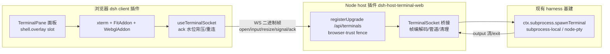

# Terminal Integration — 模块任务看板

为 `dsh web` 页面接入可交互终端（PTY + xterm），参考 tabby-core 的 xterm 前端，体验要求丝滑（不闪烁、滚动跟手、响应快）。

架构：浏览器 client 插件 `dsh-client-ui-terminal`（shell.overlay 浮层面板 + xterm）通过 WS 二进制帧直连 host 插件 `dsh-host-terminal-web`（`/api/terminals` 升级端点），后者桥接既有 `ctx.subprocess.spawnTerminal`（node-pty）。双端共用零依赖共享协议包 `dsh-terminal-protocol`，避免帧契约漂移。

## 模块状态看板

| # | 模块 | 状态 | 前置依赖 | 交付物 |
|---|------|------|---------|--------|
| 01 | 共享协议包 `dsh-terminal-protocol` | ✅ 已完成 | — | 帧协议编解码 + 单测 |
| 02 | host 插件 `dsh-host-terminal-web` | ✅ 已完成 | 01 | WS 升级端点 + PTY 桥接 + 单测 |
| 03 | client 插件骨架 `dsh-client-ui-terminal` | ✅ 已完成 | 02 | 包骨架 + shell.overlay 挂载 + roster |
| 04 | xterm 最小闭环 | 🚧 代码完成（待手动验证） | 03 | 页面内可输入/输出 |
| 05 | 丝滑体验（resize/滚动/背压） | ✅ 已完成 | 04 | 滚动跟手、大输出不卡 |
| 06 | 渲染器与主题（WebGL/GPU 恢复） | ⬜ 待办 | 05 | 硬件加速 + 主题联动无闪烁 |
| 07 | 文档与门禁 | ⬜ 待办 | 06 | architecture + Note + 测试 + gates |

## 模块依赖图

## 跨模块契约（双端必须一致，勿单侧改动）

- **帧格式**：一条 WS 消息 = 一个帧 = 首字节 opcode + 余下 payload。枚举值见 `dsh-terminal-protocol` 的 `TerminalFrameOpcode`（client→server 0x01–0x05，server→client 0x81–0x83）。
- **整数编码一律小端**（`Uint16LE`/`Uint32LE`）。
- **维度校验**：cols/rows 整数且 1..=512（`TERMINAL_MAX_DIMENSION`），在 WS 边界校验。
- **一个 socket = 一个 PTY 生命周期**；断开不恢复会话，client 重连后重放 `open` 帧起新 shell。
- 需要改动帧协议时，先改共享包 + 双端引用，再跑双端单测，禁止只改一侧。

## 全局验收总门禁

- `pnpm run typecheck` / `pnpm run lint` 通过（含新包）。
- `pnpm run test` 全绿（新增协议/桥接/组件单测）。
- `pnpm run build` 通过（host lib + client bundle 均产出）。
- 页面手动验证：打开面板 → 起 shell → 敲命令有回显 → 调整尺寸不闪 → 大输出滚动跟手 → 关面板清理无僵尸进程。

## 模块文档

| 文件 | 内容 |
|------|------|
| [01-shared-protocol.md](01-shared-protocol.md) | 共享协议包：帧契约、编解码、单测 |
| [02-host-plugin.md](02-host-plugin.md) | host 插件 + 基础设施改动（resize/重导出/references） |
| [03-client-skeleton.md](03-client-skeleton.md) | client 插件骨架、shell.overlay 注册、roster |
| [04-xterm-loop.md](04-xterm-loop.md) | xterm 基础渲染 + input/output 直连 |
| [05-smooth-ux.md](05-smooth-ux.md) | FitAddon + resize 节流、pinnedToBottom、ack 背压 |
| [06-renderer-theme.md](06-renderer-theme.md) | WebGL/GPU 恢复、主题联动、系统字体栈 |
| [07-docs-gates.md](07-docs-gates.md) | 架构文档、Agent Note、测试与门禁 |
